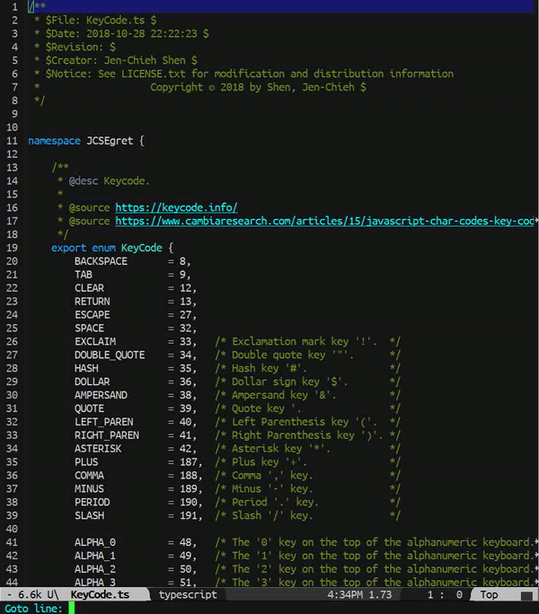

[](https://travis-ci.com/jcs-elpa/goto-line-preview)
[](https://melpa.org/#/goto-line-preview)
[](https://stable.melpa.org/#/goto-line-preview)
[](https://www.gnu.org/licenses/gpl-3.0)

# goto-line-preview
> Preview line when executing `goto-line` command.

<p align="center">
  
</p>

Normally `goto-line` will just ask for input of the line number then once you hit 
`RET`; it will just go to that line of code. This package makes this better by 
navigating the line while you are inputting in minibuffer.

*P.S. Inspired by [Visual Studio Code](https://code.visualstudio.com/) goto line preset behavior.*

## Usage

Call it from `minibuffer` directly, 

```
M-x goto-line-preview
```

Or you can bind it globally to replace `goto-line`:

```el
(global-set-key [remap goto-line] 'goto-line-preview)
```

## Contribution

If you would like to contribute to this project, you may either 
clone and make pull requests to this repository. Or you can 
clone the project and establish your own branch of this tool. 
Any methods are welcome!
